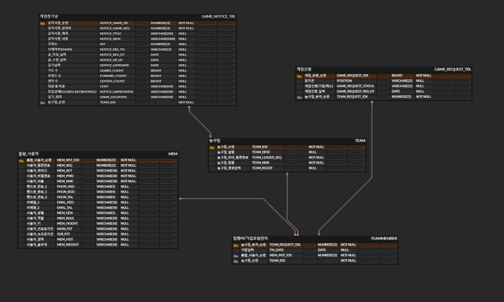
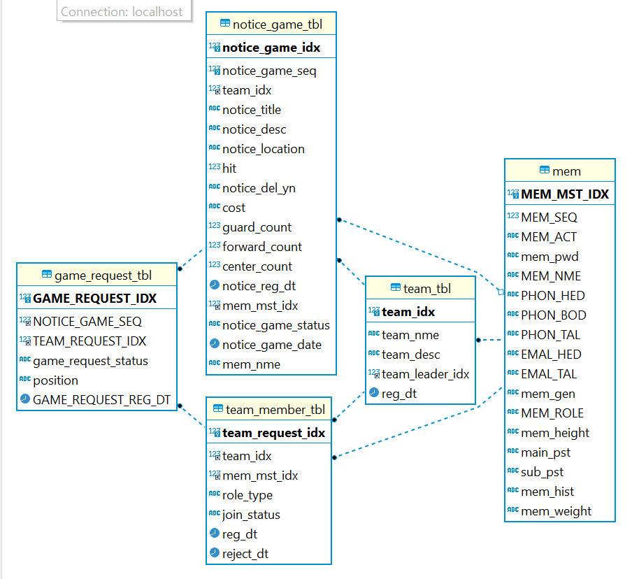

# 🏀 Basket Zone 🏀

## 📌 프로젝트 소개

**Basket Zone**는 남녀노소 누구나 농구를 즐길 수 있도록 만든 웹 애플리케이션입니다.  
사용자는 팀을 효율적으로 생성하고 가입하며, 팀원을 관리하고 시합을 생성할 수 있습니다.

시합 생성 시, 매니저는 총 참가 인원과 포지션별 인원 수를 지정할 수 있으며,  
참가자는 미리 정해진 포지션뿐 아니라 **사용자 지정(커스텀) 포지션**으로도 신청이 가능합니다.

또한 사용자는 여러 팀에 소속될 수 있으며, 각 팀의 시합 일정을 **캘린더 형식으로 확인**할 수 있습니다.


## 🛠 사용 기술
- Java 17
- Spring Boot
- JPA
- JWT
- MySQL
- JavaScript, React
- JWT (토큰 기반 인증)

## ✨ 주요 기능
- 회원가입 / 로그인 (JWT 발급)
- 마이페이지 및 회원 정보 수정
- 농구 팀 생성 / 가입 요청 / 승인 관리
- 자유로운 소속팀 변경 가능
- 시합 생성 및 포지션 선택 시합 신청(Modal 기능 구현)
- 각각의 팀에서 신청한 시합 일정 캘린더(세부사항)


## 🖥️ ERD
처음 설계 했을 시 erd


프로젝트 완성 후 erd


## 어려웠던 점, 느낀점 
혼자 프로젝트를 하는 것이다 보니 설계할 때 시간이 꽤 걸렸습니다.
또 프로젝트를 하면서 설계 했던 부분들이 잘못된 부분들을 수정하는 과정에서 아무리 처음에 설계를 잘했어도,
제작하는 과정에서 많이 바뀔 수 있다는 걸 알았고, 문서화의 힘이 엄청 나다는 것을 알 수 있었습니다.

Enum을 활용하는 게 무궁무진하다는 것을 알 수도 있었습니다.(Position,RoleType,DelYn)

당연히 성능 문제였습니다. 아무리 쿼리 짜는거에 자신있어도, N+1를 해결하려고 했기에 성능적으로
고민을 했습니다. 특히 각각의 다른팀들로부터 내가 신청했던 경기들 혹은 내가 생성했던 경기를 불러오는
비지니스 로직을 짤 때 머리 아팠던 것 같습니다. 최대한 Entity를 노출하지 않기 위해 노력하기 위해 DTO를 정말
많이 활용하였습니다. 덕분에 성능 문제를 이겨(?)낼 수 있었습니다.

JWT 경우 할 때마다 막히는 것 같아요......버전마다 바뀌기도하고 프론트랑 연동도 같이 하려다 보니 오래걸렸던 것 같습니다.
==
사실 UI가 가장 어려웠습니다. React,JS에 대해 능숙하지 않다보니, 최대한 농구에 대한 열정적인 페이지임을 보여주기 위해 노력은했지만,,,
쉽지는 않았습니다. 백엔드 로직 위주로 봐주심 감사하겠습니다.


## 🚀 실행 방법
```bash
git clone https://github.com/yourname/basketball-team-project.git
cd basketball-team-project
./mvnw spring-boot:run

